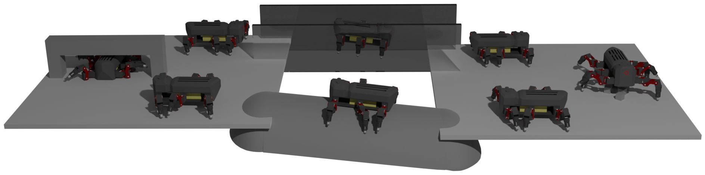

# Versatile modular neural locomotion control with fast learning
Code for M. Thor et al., Versatile modular neural locomotion control with fast learning, 2021, submitted to NMI.



_Drawing inspiration from animal locomotion, we propose a simple yet versatile modular neural control structure with fast learning. The key advantages of our approach are that behavior-specific control modules can be added incrementally to obtain increasingly complex emergent locomotion behaviors, and that neural connections interfacing with existing modules can be quickly and automatically learned._

### Content:
- [System Requirements](#system-requirements)
- [Code overview](#code-overview)
- [Install](#install)
- [Run the controller with learned weights](#run-the-controller-with-learned-weights)
- [Run learning algorithm](#run-learning-algorithm)
- [License](#license)

## System Requirements
This code has been tested with the following hardware and software:
- Intel® Core™ i9-9900K CPU @ 3.60GHz × 16
- GeForce RTX 2080
- Ubuntu 18.04.4 LTS
- coppeliaSim V4.1.0
- Vortex physics engine<sup>1</sup>
- Python 3.7.7
- ROS melodic

<sup>1</sup> _**The Vortex physics engine** requires a license (which is free for researchers). Alternatively, you can use the Newton physics engine, but for that, we cannot guarantee successful behaviors. Especially, the wall and pipe climbing behaviors does not work well with the Newton physics engine. We hypothesize that this is because the behavior was learned with the Vortex physics engine and because the behavior requires the higher complexity of that engine. To test the remaining behaviors an modified version of the advanced environment called_ `Advanced_newton_env.ttt` _has been made._

## Code overview
The following explains the content of the six main directories:
- **data**: Contains data from running the simulation and PI^BB algorithm _(both data used in the result section (in the storage directory) as well as job files used during learning)_. Additionally, it contains the learned weight sets (as `.json` files) for the base controller and eight behavior-specific modules presented in the paper. For a more detailed explaination see the README.md file in the data directory.
- **interfaces**:
Contains `.lua` files for interfacing with and setting up the simulation. It also contains the `build_dir` for `cmake`.
- **machine_learning**:
Contains all the code necessary for the PI^BB learning algorithm as well as bash scripts for running the simulation.
- **neural_controllers**:
Contains all the code nesseary for the locomotion controller (i.e., the CPG-RBF network).
- **simulations**:
Contains coppeliaSim simulation environments (including the MORF hexapod robot).
- **utils**:
Contains additional utilities needed by the controller implementation and simulation interface.

## Install
_Install time will take 15-30 minutes._

First, we need to set up the simulation ([coppeliaSim](https://www.coppeliarobotics.com/)):
1. Download coppeliaSim EDU [from the downloads page](https://www.coppeliarobotics.com/previousVersions) _(tested on V4.1.0 / Ubuntu 18.04)_.
2. Clone this repository to your local machine _(optional: set `$FRAMEWORK_PATH` to the path for the directory containing the cloned repository)_.
```bash
git clone https://github.com/MathiasThor/CPG-RBFN-framework.git
```
3. Extract the downloaded .zip file into a directory as many times as you need "simulation workers" _(i.e., the number of simulations running in parallel. We used four workers in all our experiments)_.
4. Rename the extracted coppeliaSim directories as: `VREP1`, `VREP2`, `VREP3`, `VREP4`, etc. _(optional: set `$VREP_WORKER_PATH` to the path for the directory containing the workers)_.
5. In `remoteApiConnections.txt` in each of the `VREP#` directories, change `portIndex1_port` so that `VREP1` has `19997`, `VREP2` has `19996`, `VREP3` has `19995`, `VREP4` has `19994`, etc.
6. Copy `libv_repExtRosInterface.so` into each of the worker directories from the utils directory.
```bash
cp $FRAMEWORK_PATH/CPG-RBFN-framework/utils/libv_repExtRosInterface.so $VREP_WORKER_PATH/VREP1/
```
7. Install the required python libraries _(matplotlib, jupyter, drawnow, and numpy)_.
```bash
cd $FRAMEWORK_PATH/CPG-RBFN-framework/
```
```bash
sudo apt install python3-pip
```
```bash
pip3 install -r requirements.txt
```
8. Install LIB GSL.
```bash
sudo apt-get install libgsl-dev
```

The neural controllers use ROS to communicate with coppeliaSim. Therefore, make sure that `ros-xxx-desktop-full` _(tested on melodic)_ is installed ([ROS install guide](http://wiki.ros.org/ROS/Installation))

## Run the controller with learned weights
1. Start an ROS core.
```bash
roscore
```
3. Start the simulation workers. In this example, we will only need a single worker.
```bash
cd $VREP_WORKER_PATH/VREP1/
```
```bash
./coppeliaSim.sh $FRAMEWORK_PATH/CPG-RBFN-framework/simulations/Advanced_env.ttt
```
3. Build the locomotion controller.
```bash
cd $FRAMEWORK_PATH/CPG-RBFN-framework/interfaces/morf/sim/build_dir
```
```bash
rm CMakeCache.txt
```
```bash
cmake .
```
```bash
make
```
4. Run with the learned weights presented in the paper for 400s.
```bash
cd $FRAMEWORK_PATH/CPG-RBFN-framework/machine_learning
```
```bash
./run_sim.sh -t 400
```
5. Select option **2** then **9** and finally **0**.
6. It is expected that MORF will be able to traverse all the waypoints in the advanced environment _(tested with the Vortex physics engine. See [System Requirements](#system-requirements)<sup>1</sup>)_.

## Run learning algorithm
The following will show how to start learning the base controller. It is in this way possible to reproduce the quantitative results in the manuscript.

1. Start a ROS core.
```bash
roscore
```
3. Start the simulation workers. In this example, we will use four workers.
```bash
cd $VREP_WORKER_PATH/VREP1/
```
```bash
./coppeliaSim.sh $FRAMEWORK_PATH/CPG-RBFN-framework/simulations/MORF_base_behavior.ttt
```
```bash
cd $VREP_WORKER_PATH/VREP2/
```
```bash
./coppeliaSim.sh $FRAMEWORK_PATH/CPG-RBFN-framework/simulations/MORF_base_behavior.ttt
```
```bash
cd $VREP_WORKER_PATH/VREP3/
```
```bash
./coppeliaSim.sh $FRAMEWORK_PATH/CPG-RBFN-framework/simulations/MORF_base_behavior.ttt
```
```bash
cd $VREP_WORKER_PATH/VREP4/
```
```bash
./coppeliaSim.sh $FRAMEWORK_PATH/CPG-RBFN-framework/simulations/MORF_base_behavior.ttt
```
3. Build the locomotion controller.
```bash
cd $FRAMEWORK_PATH/CPG-RBFN-framework/interfaces/morf/sim/build_dir
```
```bash
rm CMakeCache.txt
```
```bash
cmake .
```
```bash
make
```
4. In `$FRAMEWORK_PATH/CPG-RBFN-framework/machine_learning/RL_master.py` set the following.
```python
workers = 4
behaviour_selector = "walk"
```
7. Start the learning algorithm.
```bash
./RL_repeater.sh -t 1 -e indirect -r MORF
```
6. The program will now be running MORF (-r MORF) for 100 iterations one time (-t 1) using an indirect (-e indirect) encoding. Every 5th iteration will be shown visually in coppeliaSim, while all others will be blacked out for performance boost. It is expected that MORF will learn to walk within 20 iterations.

_Note that learning the advanced modules requires the user to set the behavior active (i.e., = 1) in `neutronController.cpp` line 276, 281, 286, 291, or 296._

## License
All software is available under the [GPL-3](http://www.gnu.org/licenses/gpl.html) license.

[](https://www.gnu.org/licenses/gpl-3.0)
